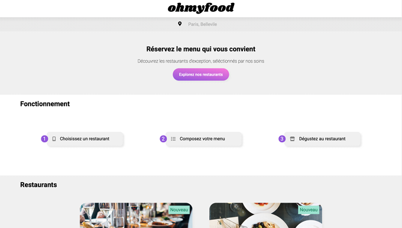
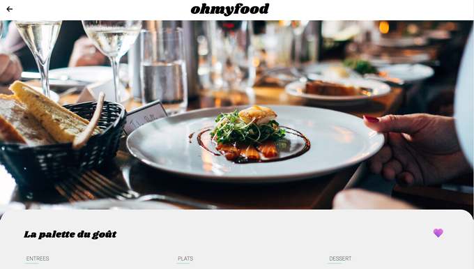
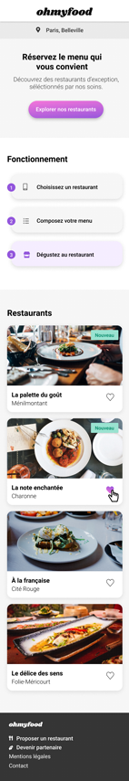
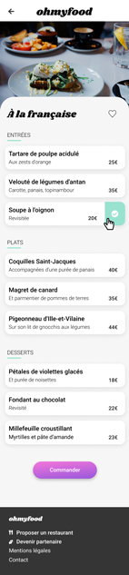

# Project 3 " Ohmyfood!" from React JS Application Developer Training: 
Liven up a web page with CSS animations 
##
Skills developed:
- Set up your Front-End environment
- Use a version control system for project tracking and hosting
- Ensure the graphic consistency of a website
- Implement advanced graphical CSS effects
- Set up a navigation structure for a website
##
Start the project: 
Nothing to install here, just open the index.html file.
##
To view the page online click  :point_right: [here](https://cla31.github.io/projet-3-OCR/index.html)
##
##
Application overview  (in desktop version):
 
 

 
 

 
 
Application overview (in mobile version):
 
 
Home page          |  Restaurant page
:-------------------------:|:-------------------------:
 | 
 
 

